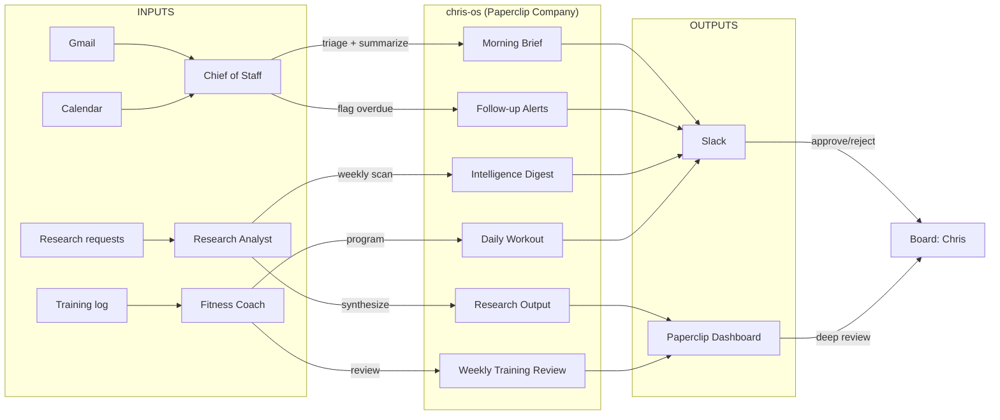

# chris-os — Infrastructure and Personal Agents

chris-os is a Paperclip company that contains two things: the infrastructure that makes the entire system run (Paperclip server, Slack bridge, monitoring), and Chris's personal agents (Chief of Staff, Fitness Coach, Research Analyst).

---

## The Problem

Chris runs multiple ventures, maintains an active personal life (fitness, music, Buddhist practice), and manages a constant stream of email, Slack, and information. Without a system, high-leverage activities get crowded out by operational noise. The goal is: Chris spends time on decisions, creativity, and relationships — not on sorting email, remembering workout programming, or manually tracking what needs attention.

---

## How It Works

---

## Agents

### Chief of Staff
**Purpose:** Protect Chris's attention. Triage email, surface decisions, track follow-ups.
**Heartbeat:** 3x daily (7am triage, 12pm check, 6pm summary)
**Key behavior:** Classifies emails into Action Required / FYI / Delegate / Archive. Drafts one-line summaries for Action Required items. Tracks sent emails awaiting response and flags at 48hrs. Observes patterns and recommends new email rules (senders, keywords → labels) for Board approval.

### Fitness Coach (Phase 3)
**Purpose:** Handle the programming math for Chris's training across three modalities (strength, running, mobility).
**Heartbeat:** Daily (6am: today's workout) + Weekly (Sunday: program review)
**Key behavior:** Progressive overload calculations, periodization management, deload detection, volume tracking by muscle group and weekly mileage.

### Research Analyst (Phase 3)
**Purpose:** Cross-domain intelligence layer serving all ventures.
**Heartbeat:** On-demand (task-assigned) + Weekly (Friday: intelligence digest)
**Key behavior:** Multi-source research with confidence levels and source citations. Connects dots across domains.

---

## Infrastructure

### Paperclip Server
Runs on the 2021 MBP server. Manages both chris-os and tibetan-spirit companies. Provides the dashboard, budget enforcement, heartbeat scheduling, and Board governance.

### Slack Bridge
Python Slack Bolt service. Polls Paperclip every 30 seconds. Posts Block Kit messages to Slack channels. Handles approve/reject button clicks. Routes back to Paperclip.

### Monitoring
Healthchecks.io pings every 5 minutes. Slack alerts when the server goes dark or a routine fails to complete.

### Email Automation System
*(Specification in progress — will be documented here when complete)*

The email system replaces the need for dedicated email management tools by building email intelligence directly into the Chief of Staff agent. Core components:

**10 core labels** (AI-managed, matching Shortwave's limit for transition compatibility):
- Action Required, FYI, Delegate, Archive, Legal, Financial, Personal, Vendor, Scheduling, Urgent

**Project labels** (20-40 max, auto-detected):
- Applied based on sender/keyword triggers (e.g., emails from Garrett → `cgai`)
- Agent recommends new project labels when it detects recurring patterns
- Board approves before any new label is created

**Trigger documentation:**
- A single source-of-truth file lists every trigger for every label
- Updated via the observe → recommend → approve → update cycle
- Example: when Chris hires a new lawyer, the agent detects legal-related emails from the new sender and recommends adding them to the Legal label triggers

This system is being designed specification-first. The README and trigger documentation will be complete before any code is written.

---

## Routines

| Routine | Agent | Schedule | Model | Approval | Phase |
|---------|-------|----------|-------|----------|-------|
| Morning Email Triage | Chief of Staff | Daily 7am | Sonnet | Board reviews batch | 1 |
| Midday Email Check | Chief of Staff | Daily 12pm | Haiku | Urgent only to Board | 1 |
| Evening Summary | Chief of Staff | Daily 6pm | Haiku | Auto-logged | 1 |
| Email Rule Recommendations | Chief of Staff | Weekly | Haiku | Board approves | 1 |
| Daily Workout | Fitness Coach | Daily 6am | Sonnet | Board reviews | 3 |
| Weekly Training Review | Fitness Coach | Sunday evening | Sonnet | Board approves | 3 |
| Research Task | Research Analyst | On-demand | Sonnet | Board reviews | 3 |
| Friday Intelligence Digest | Research Analyst | Friday 4pm | Sonnet | Auto-logged | 3 |

---

## Configuration

### Budget Caps (Monthly)
| Agent | Budget | Model Default |
|-------|--------|---------------|
| Chief of Staff | $30/mo | Sonnet (triage), Haiku (checks) |
| Fitness Coach | $10/mo | Sonnet |
| Research Analyst | $25/mo | Sonnet |

### Approval Rules
- **Board approval required:** All email classifications (Phase 1), training programming changes, research outputs
- **Auto-logged (FYI only):** Evening summaries, intelligence digests, routine health checks
- **Auto-execute:** After graduation with sustained low override rate (Tier 1)

---

## Success Criteria

| Metric | Target | How Measured |
|--------|--------|-------------|
| Email triage accuracy | >85% match with Chris's own classification | Weekly comparison of 50 emails |
| Override rate (email) | <25% initially, trending toward <10% | Paperclip dashboard |
| Time to inbox zero | <30 min/day (down from 2-3 hrs) | Self-reported |
| Workout compliance | Workout posted by 6am, 6 days/week | Routine health check |
| Research quality | Board rates >80% of outputs as "useful" | Feedback on Paperclip tickets |

---

## For Collaborators

**Garrett (technical):** The research analyst can be assigned tasks that serve your consulting work. Submit research requests through Paperclip or ask Chris to assign them. Read the system wiki at `brain/3-Resources/system-wiki/` for full architecture context.

**Ashley (creative/design):** The system handles operational overhead so Chris has more bandwidth for collaborative work. If you need something researched, flagged, or tracked, it can be assigned to the relevant agent. Read `brain/3-Resources/system-wiki/approvals-and-oversight.md` for how to interact with the system.

---

## Known Limitations

- Email automation is in specification phase — manual triage continues until Phase 1 implementation.
- Fitness Coach and Research Analyst are Phase 3 — Chief of Staff is the only personal agent in Phase 1.
- The system requires internet access to function (Anthropic API, Gmail API, Supabase).
- Budget caps are estimates — will be refined based on actual usage data after Phase 1.
